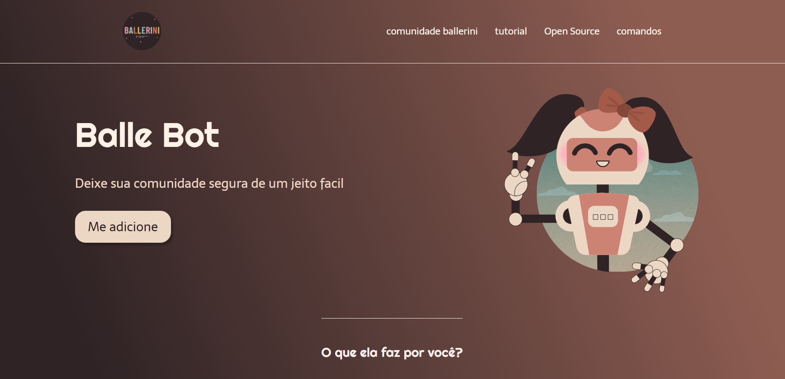

# Codifi Landing page

> Uma linda Landing page que fornece Informações sobre o bot do discord e da a possibilidade de adicionar ao seu servidor.

### Ajustes e melhorias

O projeto ainda está em desenvolvimento e as próximas atualizações serão voltadas nas seguintes tarefas:

- [x] Tarefa 1      Executar o Projeto igual o Figma
- [ ] Tarefa 2      Adicionar responsividade
- [ ] Tarefa 3      Adicionar animações

## 📫 Quer executar o projeto e aprender?
Aqui estão os links para executar o projeto

<a href="https://www.youtube.com/watch?v=llF6vD-RljE&t=3409s">Video ensinando a fazer<a/>
<a href="https://www.figma.com/file/myqP66iQwzjwjrIAJyyrip/BalleBot?node-id=0%3A1">Link do figma para o projeto<a/>

## 🤝 Criadora do projeto

Agradeço a incrivel instrutora que fez esse projeto possivel:

<table>
  <tr>
    <td align="center">
      <a href="https://github.com/rafaballerini">
         
        
          <b>Rafaella Ballerini</b>
        
      </a>
    </td>
  </tr>
</table>
